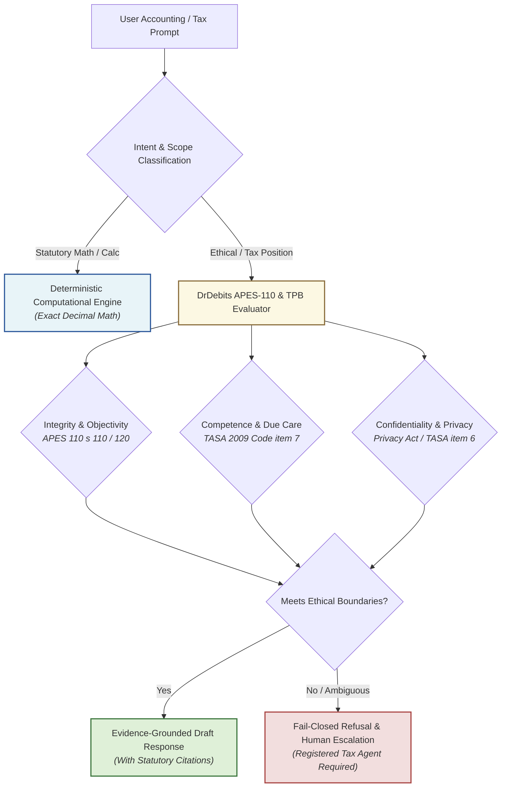

# DrDebits

[](SECURITY.md)
[](SECURITY.md)
[](#drdebits)
[](#-quick-start-for-ai-agents)
[](LICENSE)

> Australian tax-practice and accounting-ethics guardrails for LLM-assisted work
>
> Version: `0.3.1` · Jurisdiction: Australia · Sources last checked: 2026-08-16

DrDebits is an independent, source-linked operating guide for large language models assisting with Australian accounting, tax and BAS work. It converts the Tax Practitioners Board framework, APES 110, APES 220 and the sector's AML/CTF obligations into practical controls for drafting, research, calculations and review.

DrDebits does not reproduce APES 110, certify compliance, replace the source documents or replace a registered tax practitioner's or professional accountant's judgement. It is not legal, tax or financial advice. A competent, appropriately authorised human remains responsible for every professional service, judgement and consequential action.

"Dr" is part of the project name only. It does not claim a qualification, professional designation, registration, regulatory status or endorsement.

---

## ⚡ Quick start for AI Agents

Supply `drdebits.md` as persistent project context at the highest configurable instruction tier beneath immutable platform controls, then instruct the model per the "How to use this file" section of the guide. Retrieve the reference files when a routing decision needs them.

### Load into Claude Code / Antigravity
```bash
# Add as persistent project context in your repository
cp drdebits.md .claude/rules/drdebits.md
```

### Configure for Cursor (`.cursorrules`)
```markdown
# Include in your .cursorrules or project prompt:
Follow Australian accounting ethics and statutory boundaries defined in @drdebits.md.
All tax positions must be cited against primary ATO/Commonwealth sources.
```

---

## 🧭 Ethical Routing & Boundary Architecture



---

## 📂 Files & Governance

| File | Purpose |
|---|---|
| [drdebits.md](./drdebits.md) | The guide: core operating controls. Load this as persistent context. |
| [tests/behaviour-tests.md](./tests/behaviour-tests.md) | Adverse-case tests an implementation must pass |
| [reference/tpb-catalogue.md](./reference/tpb-catalogue.md) | Complete live TPB Guidance Statement catalogue, GS01 to GS55 |
| [reference/apes-110-map.md](./reference/apes-110-map.md) | Primary APES 110 reference map |
| [AGENTS.md](./AGENTS.md) | Routing instructions for autonomous coding agents |
| [DISCLAIMER.md](./DISCLAIMER.md) | Professional safe-harbor disclaimer under TASA 2009 |
| [MAINTENANCE.md](./MAINTENANCE.md) | Release and source-check protocol |
| [SHA256SUMS](./SHA256SUMS) | Digests of every DrDebits file in this release |

---

## 🔒 Integrity

Pin the approved release tag, retrieve `SHA256SUMS` at that tag and verify each file's digest before use. The `DRDEBITS-END-…` marker on the guide's final line is a truncation check only, not tamper evidence.

## 📄 Licence

Copyright © 2026 Ryan Duguid. Original DrDebits material is licensed under [CC BY 4.0](https://creativecommons.org/licenses/by/4.0/); see [LICENSE](./LICENSE). The build tooling under `tools/` is separately licensed under the [MIT License](./tools/drdebits_build/LICENSE). The licences do not extend to third-party standards, quotations, logos, trade marks or source documents. DrDebits is not endorsed by the TPB, APESB, AUSTRAC, IFAC, CA ANZ, CPA Australia or IPA.

## 🛠️ Contributing and maintenance

The guide, reference and test files are generated. Edit the sources under `src/` and run `uv run --project tools/drdebits_build python -m drdebits_build build`; CI rejects hand edits to generated files. See `MAINTENANCE.md` for the release protocol.
